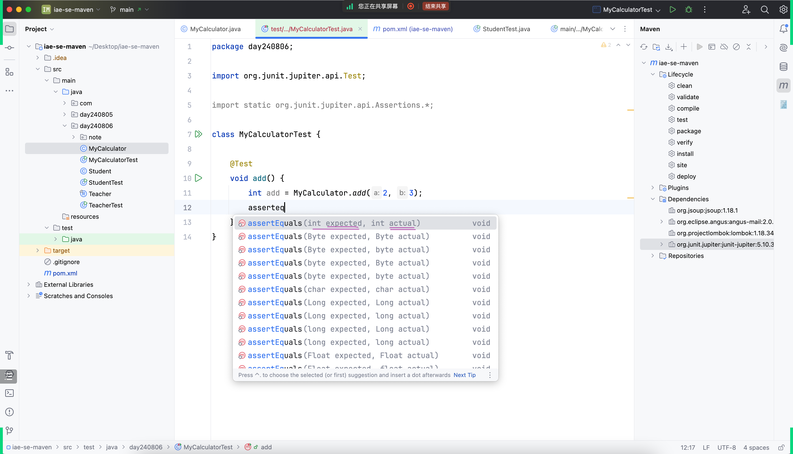

## 回顾
见上次课的笔记

## 根据昨天的 `.gitignore` 额外引出

- 从本质上理解为什么可以忽略它、删除它
  - .idea
  - target
- `临界条件` 的思路
  - 比如: 假设 gitee 每个仓库超过 5M 就要收费

## 通过 GAV 唯一定义
- 
  - https://maven.apache.org/guides/getting-started/index.html
- 
  - https://maven.apache.org/guides/mini/guide-naming-conventions.html
  - 《Java 开发手册》

## 可以开始准备域名了

## `Java Bean` 、 `POJO`

## `lombok`  
### 分析 `lombok` 的作用

### `lombok` 插件

### `lombok` 背后的思想  

## 由 `lombok` 引出 Java 的 `record` 关键字  

## 额外引出的 `git` 操作及命令
### IDEA 集成操作

### 额外命令
- 查看当前仓库下的所有 git 操作记录 
  - `git reflog --date=iso` 
- 后悔药（危险操作，考虑清楚之后才执行）
  - `git reset --hard` 【具体要回退到哪个commit 2aabfa4】

## 将自己打包好的 `jar` 包，分享给别人使用

## 引出 `JUnit5`、体会单元测试与以前普通测试的差异

## Maven Build Lifecycle

## 测试几个命令
- `mvn clean` 清理
- `mvn compile` 编译
- `mvn test` 执行单元测试
- `mvn package` 打包

### `mvn install`

