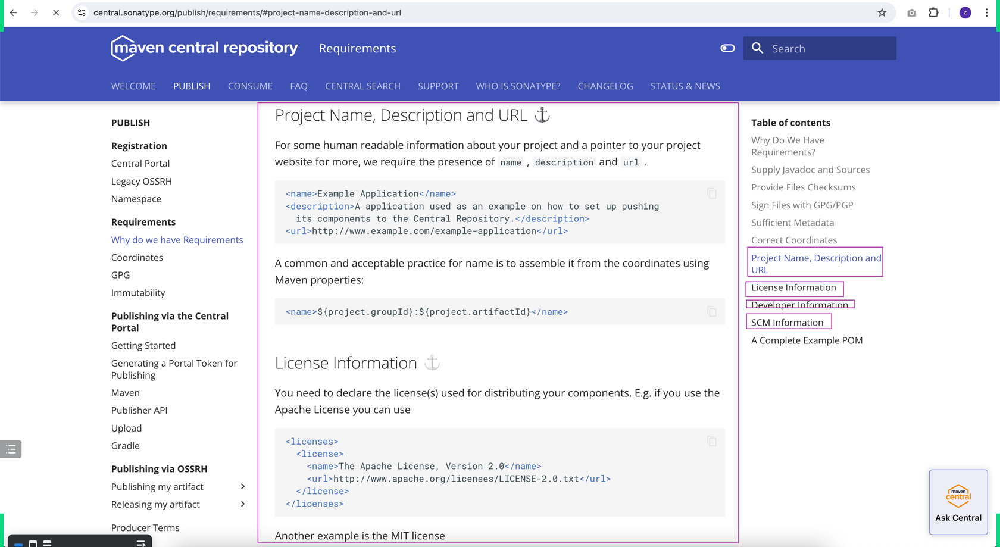
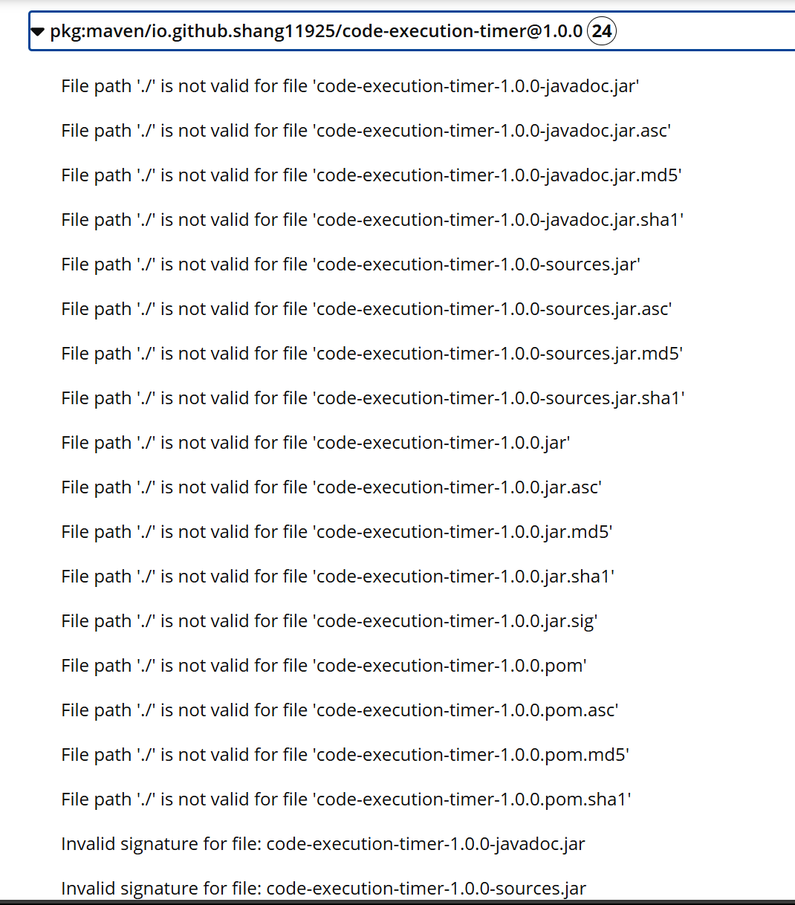
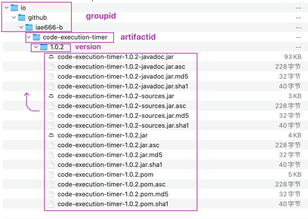
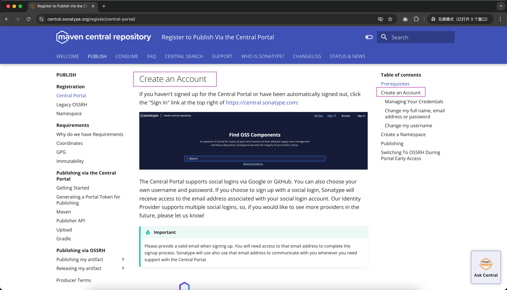
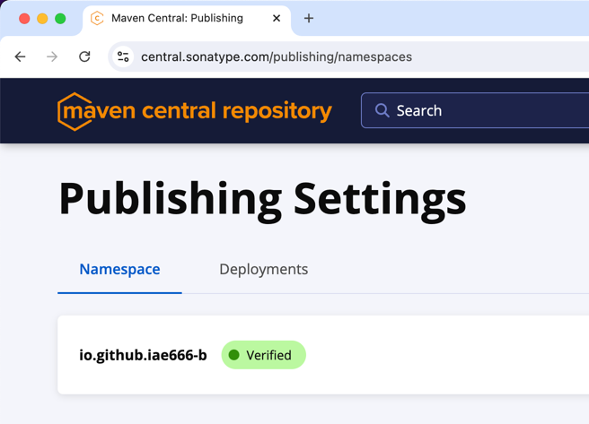
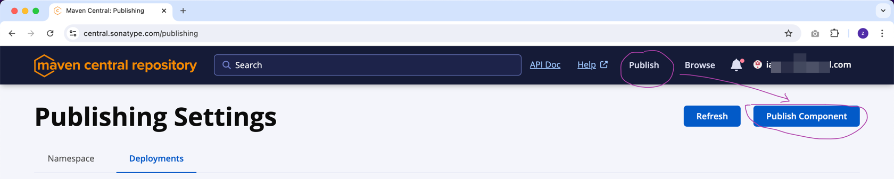
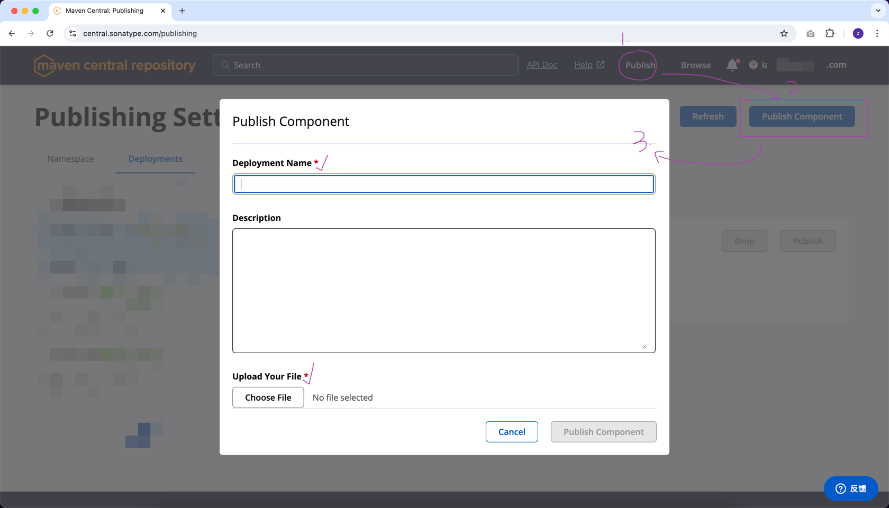
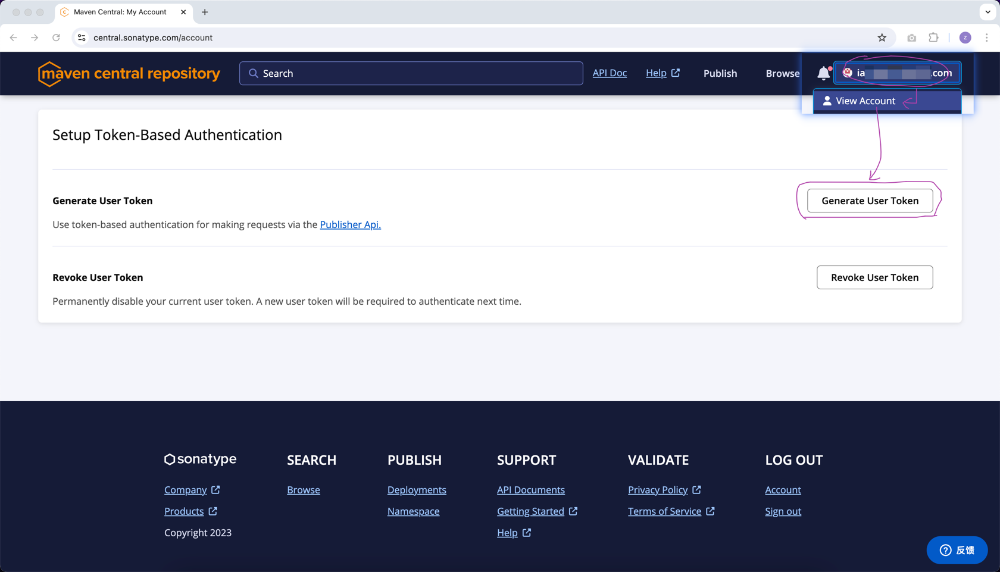
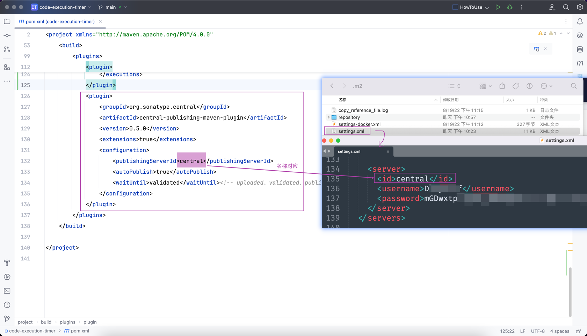
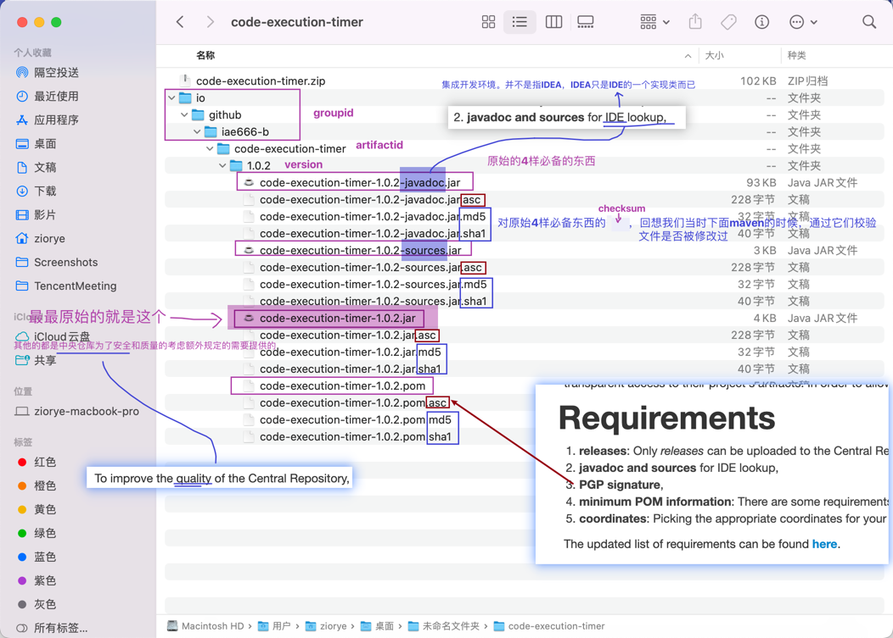

## `How to uploading artifact...` 思考过程


- Introduction to Repositories


- Guide to uploading artifacts

- Maven Repository Layout


- mini


### 方式一: 纯手工
- 纯手工的方式准备 `uploading artifact` 需要的所有东西  
- 如果你有时间，应该自己完整看一遍相关 `一手资源`

#### step1: 增加几个插件配置
- pom.xml 文件增加几个配置，让下一步执行 mvn install 命令的时候同时把 javadoc 和 sources 也同步生成好
```
<project>
  ...
  <dependencies>
    <dependency>
      ...
    </dependency>
  </dependencies>
  
  <!-- 把 build 区域的内容复制到自己项目的 pom.xml 的相应位置中 -->
  <build>
    <pluginManagement>
      <plugins>
        <plugin>
          <groupId>org.apache.maven.plugins</groupId>
          <artifactId>maven-source-plugin</artifactId>
          <version>3.3.1</version>
          <executions>
            <execution>
              <id>attach-sources</id>
              <goals>
                <goal>jar-no-fork</goal>
              </goals>
            </execution>
          </executions>
        </plugin>
        <plugin>
          <groupId>org.apache.maven.plugins</groupId>
          <artifactId>maven-javadoc-plugin</artifactId>
          <version>3.7.0</version>
          <executions>
            <execution>
              <id>attach-javadocs</id>
              <goals>
                <goal>jar</goal>
              </goals>
            </execution>
          </executions>
        </plugin>
        <plugin>
          <groupId>org.apache.maven.plugins</groupId>
          <artifactId>maven-gpg-plugin</artifactId>
          <version>3.2.4</version>
          <executions>
            <execution>
              <id>sign-artifacts</id>
              <phase>verify</phase>
              <goals>
                <goal>sign</goal>
              </goals>
            </execution>
          </executions>
        </plugin>
      </plugins>
    </pluginManagement>
  
    <plugins>
      <plugin>
        <groupId>org.apache.maven.plugins</groupId>
        <artifactId>maven-source-plugin</artifactId>
      </plugin>
      <plugin>
        <groupId>org.apache.maven.plugins</groupId>
        <artifactId>maven-javadoc-plugin</artifactId>
      </plugin>
      <plugin>
        <groupId>org.sonatype.central</groupId>
        <artifactId>central-publishing-maven-plugin</artifactId>
        <version>0.5.0</version>
        <extensions>true</extensions>
        <configuration>
          <publishingServerId>central</publishingServerId>
          <autoPublish>true</autoPublish>
          <waitUntil>validated</waitUntil><!-- uploaded、validated、published -->
        </configuration>
      </plugin>
    </plugins>
  </build>

</project>
```

#### step2：完善 pom.xml，提供必要的信息


#### step3：`mvn install` 生成那4个原始的文件
  - 去 .m2/repository/【你的 groupid 】/【artifactid】/【version】下验证有那4个上传到远程参考需要的原始资料
    - jar、javadoc、sources、pom

    - 
#### step4：Checksums
  - 参考资料：https://maven.apache.org/plugins-archives/maven-install-plugin-2.4/examples/installing-checksums.html
  - `mvn install -DcreateChecksum=true`

  - 见下次课笔记
  - 
#### step5：Signature
  - 参考资料：https://central.sonatype.org/publish/requirements/gpg/

#### step6：Layout 所有原材料都准备好之后，还要按规定的路径格式存放它们
  - 先从报错开始：

  - 正确的文件存放 layout

  - zip code-execution-timer.zip io/github/iae666-b/code-execution-timer/1.0.0/*
    - 这个压缩包解压出来的第一层直接就是 `io` 目录（你的 `groupid` 的第一点 `.` 左边的字符）

#### step7：去远程仓库(选择之一，也是 maven 官方链接过来的网站)：`https://central.sonatype.com`
- 注册 `https://central.sonatype.com` 账号，可以直接用 GitHub 的账号登录

- Create a Namespace

- Publishing



### 方式二：自动化
- 添加相应自动化插件
  - `maven-gpg-plugin`
    ```xml
        <plugin>
            <groupId>org.apache.maven.plugins</groupId>
            <artifactId>maven-gpg-plugin</artifactId>
            <version>3.2.4</version>
            <executions>
                <execution>
                    <id>sign-artifacts</id>
                    <phase>verify</phase>
                    <goals>
                        <goal>sign</goal>
                    </goals>
                </execution>
            </executions>
        </plugin>
    ```
  - `central-publishing-maven-plugin`
    ```xml
        <plugin>
            <groupId>org.sonatype.central</groupId>
            <artifactId>central-publishing-maven-plugin</artifactId>
            <version>0.5.0</version>
            <extensions>true</extensions>
            <configuration>
                <publishingServerId>central</publishingServerId>
                <autoPublish>true</autoPublish>
                <waitUntil>validated</waitUntil><!-- uploaded、validated、published -->
            </configuration>
        </plugin>
    ```
- Generate User Token

- 将上一步获取到的 username 和 password 设置到 ~/.m2/settings.xml 的 server 配置区域中

- `mvn deploy`

## 小结
### 手工
- 阅读 `一手资源`
- 理清楚了最终需要上传哪些东西到远程仓库

- 然后分步骤准备这些材料
  - 最基础的4个jar包
  - Checksums
    - `***.md5`
    - `***.sha1`
  - Signature
    - `***.asc`
- 把所有原材料安装指定的路径规则打包好
- 注册目标账户
- 上传 && 发布
- 验证使用
### 自动
- 就是将手工操作的那些复杂步骤自动化
- 手工操作的那些才是背后的本质


