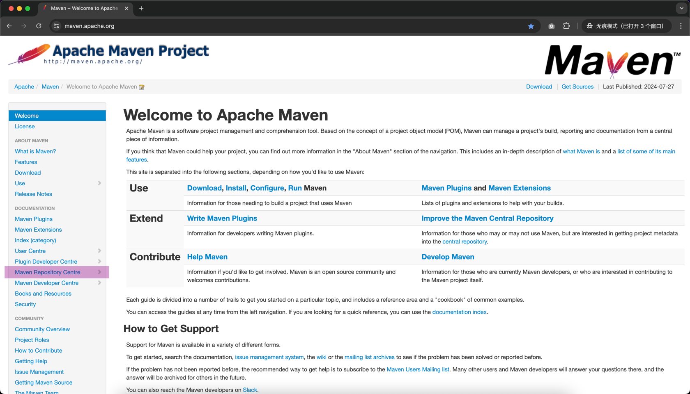
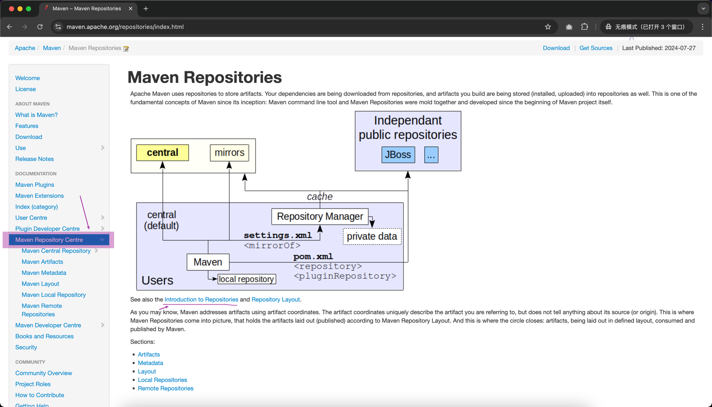
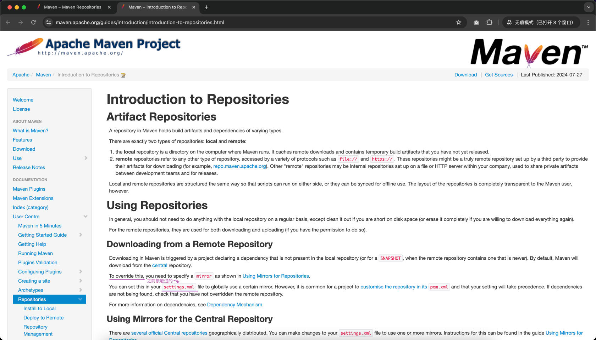
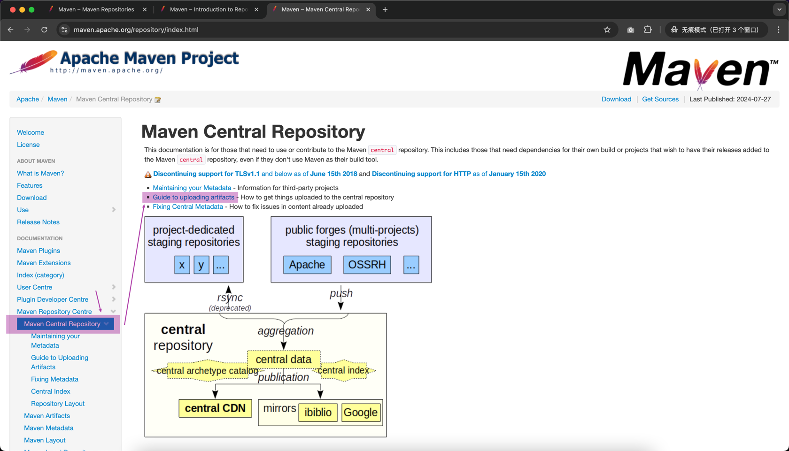
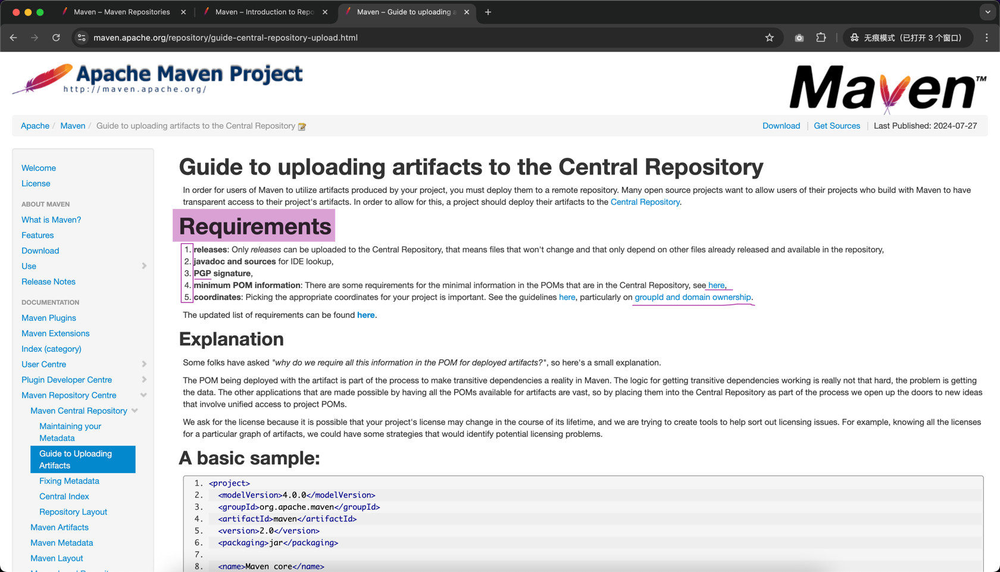
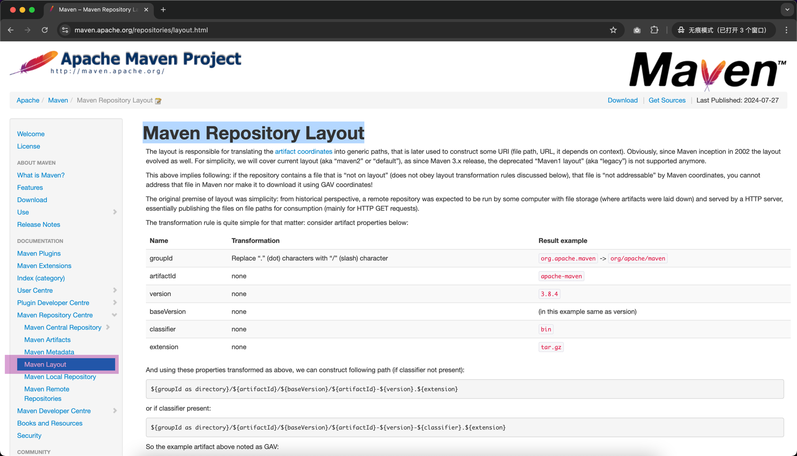
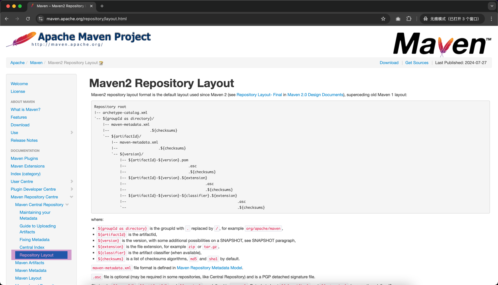
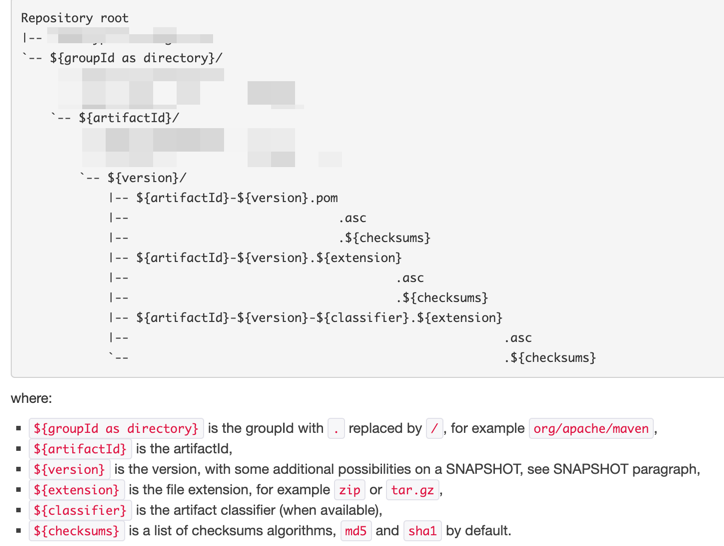
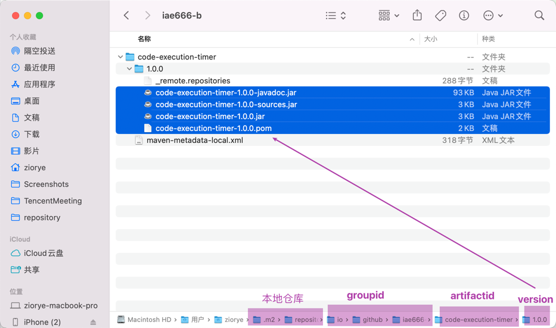
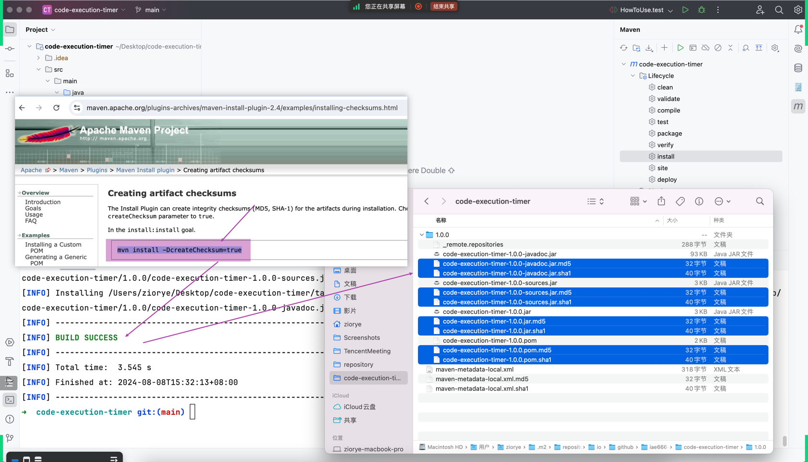

## `How to uploading artifact...` 思考过程


- Introduction to Repositories


- Guide to uploading artifacts

- Maven Repository Layout


- mini



### 方式一: 纯手工
- 纯手工的方式准备 `uploading artifact` 需要的所有东西  
- 如果你有时间，应该自己完整看一遍相关 `一手资源`

#### step1: 先提供那4个原始资料
- pom.xml 文件增加几个配置，让下一步执行 mvn install 命令的时候同时把 javadoc 和 sources 也同步生成好
```
<project>
  ...
  <dependencies>
    <dependency>
      ...
    </dependency>
  </dependencies>
  
  <!-- 把 build 区域的内容复制到自己项目的 pom.xml 的相应位置中 -->
  <build>
    <pluginManagement>
      <plugins>
        <plugin>
          <groupId>org.apache.maven.plugins</groupId>
          <artifactId>maven-source-plugin</artifactId>
          <version>3.3.1</version>
          <executions>
            <execution>
              <id>attach-sources</id>
              <goals>
                <goal>jar-no-fork</goal>
              </goals>
            </execution>
          </executions>
        </plugin>
        <plugin>
          <groupId>org.apache.maven.plugins</groupId>
          <artifactId>maven-javadoc-plugin</artifactId>
          <version>3.7.0</version>
          <executions>
            <execution>
              <id>attach-javadocs</id>
              <goals>
                <goal>jar</goal>
              </goals>
            </execution>
          </executions>
        </plugin>
        <plugin>
          <groupId>org.apache.maven.plugins</groupId>
          <artifactId>maven-gpg-plugin</artifactId>
          <version>3.2.4</version>
          <executions>
            <execution>
              <id>sign-artifacts</id>
              <phase>verify</phase>
              <goals>
                <goal>sign</goal>
              </goals>
            </execution>
          </executions>
        </plugin>
      </plugins>
    </pluginManagement>
  
    <plugins>
      <plugin>
        <groupId>org.apache.maven.plugins</groupId>
        <artifactId>maven-source-plugin</artifactId>
      </plugin>
      <plugin>
        <groupId>org.apache.maven.plugins</groupId>
        <artifactId>maven-javadoc-plugin</artifactId>
      </plugin>
      <plugin>
        <groupId>org.sonatype.central</groupId>
        <artifactId>central-publishing-maven-plugin</artifactId>
        <version>0.5.0</version>
        <extensions>true</extensions>
        <configuration>
          <publishingServerId>central</publishingServerId>
          <autoPublish>true</autoPublish>
          <waitUntil>validated</waitUntil><!-- uploaded、validated、published -->
        </configuration>
      </plugin>
    </plugins>
  </build>

</project>
```
- mvn install
  - 去 .m2/repository/【你的 groupid 】/【artifactid】/【version】下验证有那4个上传到远程参考需要的原始资料
    - jar、javadoc、sources、pom

- Checksums
  - https://maven.apache.org/plugins-archives/maven-install-plugin-2.4/examples/installing-checksums.html
  - mvn install -DcreateChecksum=true
