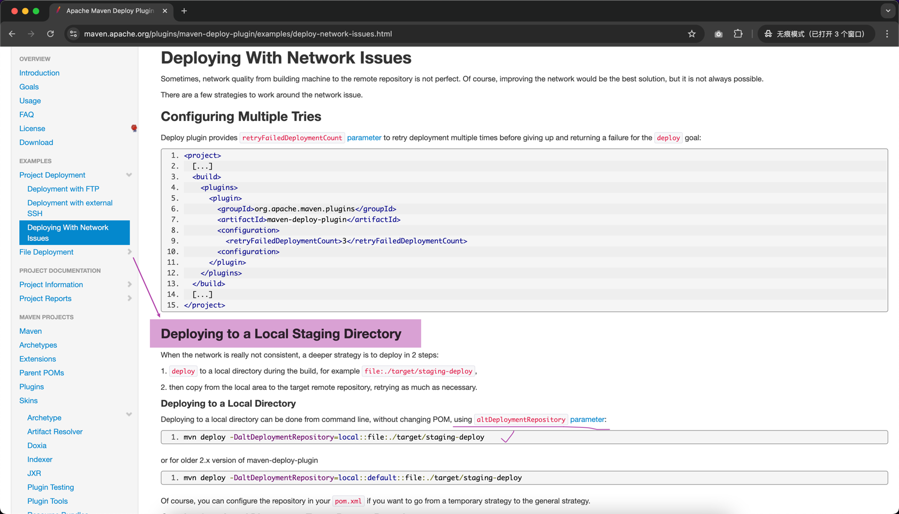

## `mvn install -DcreateChecksum=true` 问题
## 原因：maven 版本问题引起的（再次体会`阅读一手资源`的重要性）


### 我电脑上的 maven 版本是 3.9.8

### 解决办法之一
- 根据官网的描述，已经知道现在把 `createChecksum` 功能移到了 `deploy` 插件，那我们就改调用 `mvn deploy ...` 命令来解决

- https://maven.apache.org/plugins/maven-deploy-plugin/examples/deploy-network-issues.html
- mvn deploy -DaltDeploymentRepository=local::file:./target/staging-deploy

### 解决办法之二
- 降低 maven 版本，使得 `Maven Install Plugin` 低于 3.x 版本

## 到目前为止，只差 `PGP signature` 了
- 参考资源：https://central.sonatype.org/publish/requirements/gpg/

### 核心步骤
Installing GnuPG、Generating a Key Pair、Listing Keys、Signing a File、Distributing Your Public Key


### Distributing Your Public Key的步骤如果遇到问题

- 参考资源：https://vayne.cc/2022/03/13/gpg/
- 打开 https://keyserver.ubuntu.com


- 导出公钥的命令
  - gpg -a -o public.key --export 【你的那串ID】
  -  在当前执行命令所在目录下打开 public.key，把文件里面的内容提交到上图点击 Submit Key 按钮弹出的框中

### 用 pgp 对那 4 个 jar 包进行 signature => ***jar.asc
- gpg -ab code-execution-timer-1.0.0.jar
- gpg -ab code-execution-timer-1.0.0-javadoc.jar
- gpg -ab code-execution-timer-1.0.0-sources.jar
- gpg -ab code-execution-timer-1.0.0.pom

### 校验所有需要的文件是否都准备好了


## 打成压缩包
- 先检查昨天笔记中的 step2：完善 pom.xml，提供必要的信息 ***做好了没***
- 再参考昨天笔记的 step6
  - zip code-execution-timer.zip io/github/iae666-b/code-execution-timer/1.0.0/*
  - 这个压缩包解压出来的第一层直接就是 `io` 目录（`groupid` 的第一点 . 左边的字符）

## 上传 && 发布

### 参考昨天笔记的 step7


### 上传之后参考配图

#### 验证成功

#### Publish 真正发布


## 验证
- 把之前安装到本地 .m2/repository 的 artifact 删掉
- 在 IDEA 的 maven 那边刷新一下，看是否能从远程下载回来

## 改进1：用 maven 插件，自动生成 `PGP signature`  
- 见昨天笔记的 maven-gpg-plugin

## 改进2：用 maven 插件，自动上传 && 发布
- 见昨天笔记的 central-publishing-maven-plugin

## 改进3：pom.xml 中的 build 内容精简优化，暂时先不用 pluginManagement
```
<build>
    <plugins>
        <plugin>
            <groupId>org.apache.maven.plugins</groupId>
            <artifactId>maven-javadoc-plugin</artifactId>
            <version>3.8.0</version>
            <executions>
                <execution>
                    <goals>
                        <goal>jar</goal>
                    </goals>
                </execution>
            </executions>
        </plugin>
        <plugin>
            <groupId>org.apache.maven.plugins</groupId>
            <artifactId>maven-source-plugin</artifactId>
            <version>3.3.1</version>
            <executions>
                <execution>
                    <goals>
                        <goal>jar-no-fork</goal>
                    </goals>
                </execution>
            </executions>
        </plugin>
        <plugin>
            <groupId>org.apache.maven.plugins</groupId>
            <artifactId>maven-gpg-plugin</artifactId>
            <version>3.2.4</version>
            <executions>
                <execution>
                    <id>sign-artifacts</id>
                    <phase>verify</phase>
                    <goals>
                        <goal>sign</goal>
                    </goals>
                </execution>
            </executions>
        </plugin>
        <plugin>
            <groupId>org.sonatype.central</groupId>
            <artifactId>central-publishing-maven-plugin</artifactId>
            <version>0.5.0</version>
            <extensions>true</extensions>
            <configuration>
                <publishingServerId>central</publishingServerId>
                <autoPublish>true</autoPublish>
                <waitUntil>validated</waitUntil><!-- uploaded、validated、published -->
            </configuration>
        </plugin>
    </plugins>
</build>
```

## `uploading artifact` 小结
### 手动
- 一步步准备需要的材料
### 半自动
- 借助 maven 插件自动生成
- 手动上传 && 发布
### 全自动
- 借助 maven 插件完成所有步骤


