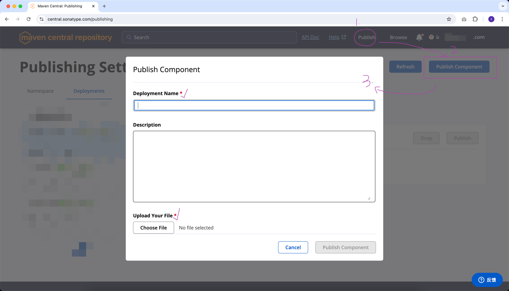
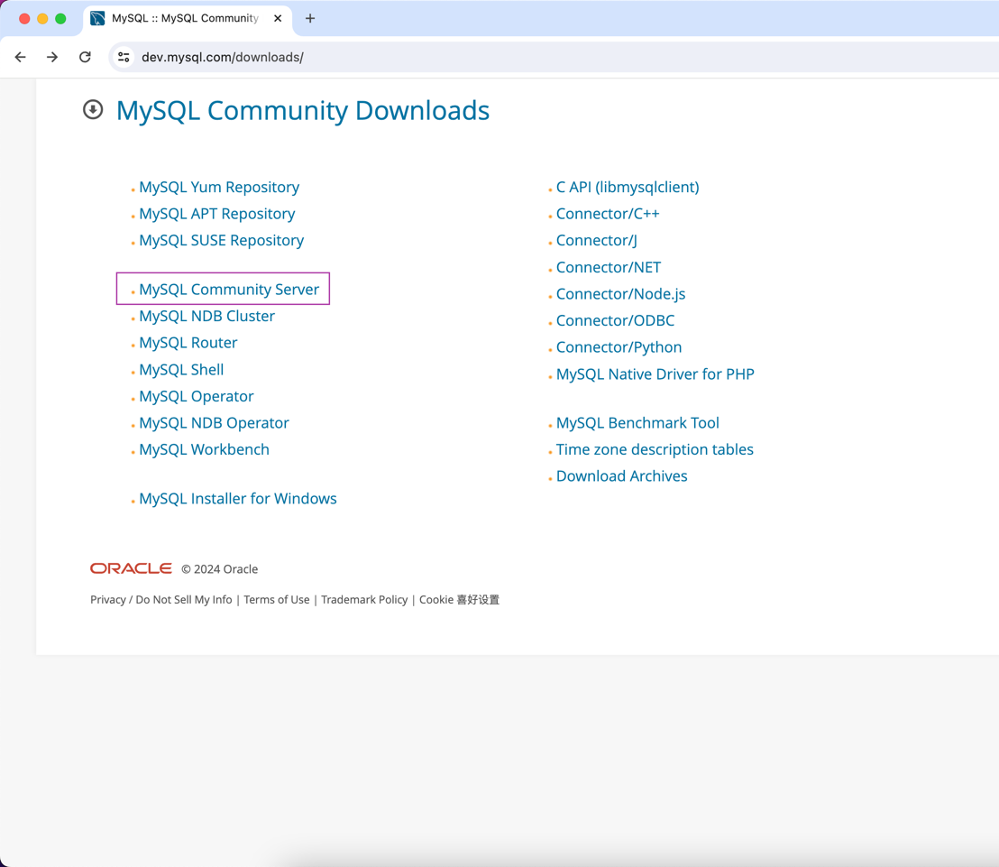

## `mvn install -DcreateChecksum=true` 问题
## 原因：maven 版本问题引起的（再次体会`阅读一手资源`的重要性）


### 我电脑上的 maven 版本是 3.9.8

### 解决办法之一
- 根据官网的描述，已经知道现在把 `createChecksum` 功能移到了 `deploy` 插件，那我们就改调用 `mvn deploy ...` 命令来解决

- https://maven.apache.org/plugins/maven-deploy-plugin/examples/deploy-network-issues.html
- mvn deploy -DaltDeploymentRepository=local::file:./target/staging-deploy

### 解决办法之二
- 降低 maven 版本，使得 `Maven Install Plugin` 低于 3.x 版本

## 到目前为止，只差 `PGP signature` 了
- 参考资源：https://central.sonatype.org/publish/requirements/gpg/

### 核心步骤
Installing GnuPG、Generating a Key Pair、Listing Keys、Signing a File、Distributing Your Public Key


### Distributing Your Public Key的步骤如果遇到问题

- 参考资源：https://vayne.cc/2022/03/13/gpg/
- 打开 https://keyserver.ubuntu.com


- 导出公钥的命令
  - gpg -a -o public.key --export 【你的那串ID】
  -  在当前执行命令所在目录下打开 public.key，把文件里面的内容提交到上图点击 Submit Key 按钮弹出的框中

### 用 pgp 对那 4 个 jar 包进行 signature => ***jar.asc
- gpg -ab code-execution-timer-1.0.0.jar
- gpg -ab code-execution-timer-1.0.0-javadoc.jar
- gpg -ab code-execution-timer-1.0.0-sources.jar
- gpg -ab code-execution-timer-1.0.0.pom

### 校验所有需要的文件是否都准备好了


## 打成压缩包
- 先检查昨天笔记中的 step2：完善 pom.xml，提供必要的信息 ***做好了没***
- 再参考昨天笔记的 step6
  - zip code-execution-timer.zip io/github/iae666-b/code-execution-timer/1.0.0/*
  - 这个压缩包解压出来的第一层直接就是 `io` 目录（`groupid` 的第一点 . 左边的字符）

## 上传 && 发布

### 参考昨天笔记的 step7




### 上传之后参考配图

#### 验证成功

#### Publish 真正发布


## 验证
- 把之前安装到本地 .m2/repository 的 artifact 删掉
- 在 IDEA 的 maven 那边刷新一下，看是否能从远程下载回来

## 改进1：用 maven 插件，自动生成 `PGP signature`  
- 见昨天笔记的 maven-gpg-plugin

## 改进2：用 maven 插件，自动上传 && 发布
- 见昨天笔记的 central-publishing-maven-plugin

## 改进3：pom.xml 中的 build 内容精简优化，暂时先不用 pluginManagement
```dtd
<build>
    <plugins>
        <plugin>
            <groupId>org.apache.maven.plugins</groupId>
            <artifactId>maven-javadoc-plugin</artifactId>
            <version>3.8.0</version>
            <executions>
                <execution>
                    <goals>
                        <goal>jar</goal>
                    </goals>
                </execution>
            </executions>
        </plugin>
        <plugin>
            <groupId>org.apache.maven.plugins</groupId>
            <artifactId>maven-source-plugin</artifactId>
            <version>3.3.1</version>
            <executions>
                <execution>
                    <goals>
                        <goal>jar-no-fork</goal>
                    </goals>
                </execution>
            </executions>
        </plugin>
        <plugin>
            <groupId>org.apache.maven.plugins</groupId>
            <artifactId>maven-gpg-plugin</artifactId>
            <version>3.2.4</version>
            <executions>
                <execution>
                    <id>sign-artifacts</id>
                    <phase>verify</phase>
                    <goals>
                        <goal>sign</goal>
                    </goals>
                </execution>
            </executions>
        </plugin>
        <plugin>
            <groupId>org.sonatype.central</groupId>
            <artifactId>central-publishing-maven-plugin</artifactId>
            <version>0.5.0</version>
            <extensions>true</extensions>
            <configuration>
                <publishingServerId>central</publishingServerId>
                <autoPublish>true</autoPublish>
                <waitUntil>validated</waitUntil><!-- uploaded、validated、published -->
            </configuration>
        </plugin>
    </plugins>
</build>
```

## `uploading artifact` 小结
### 手动
- 一步步准备需要的材料
### 半自动
- 借助 maven 插件自动生成
- 手动上传 && 发布
### 全自动
- 借助 maven 插件完成所有步骤


## MySQL


## 从几个问题开始
- MySQL 的 My 是什么意思
- MySQL 的 SQL 是什么意思
- MySQL 的发音是什么

## 阅读一手资源逐一解答
- The My part of MySQL stands for ...

- The SQL part of MySQL stands for ...

- The official way to pronounce “MySQL” is ...


## What is MySQL?
### 存储
- 内存
- 文件
- 专业的存储软件
### 主流数据库软件
DB-Engines Ranking https://db-engines.com/en/ranking


### Download

- https://www.mysql.com/
- downloads
- MySQL Community (GPL) Downloads
  - Windows: MySQL Installer for Windows


  - macOS: MySQL Community Server


- No thanks, just start my download


## MD5 checksums and GnuPG signatures

- for windows: certutil -hashfile filename MD5
- for Linux: md5sum filename
- for macOS: md5 mysql-8.0.37-macos14-x86_64.dmg
```
# macOS
md5 mysql-8.0.37-macos14-x86_64.dmg
MD5 (mysql-8.0.37-macos14-x86_64.dmg) = bd21d9c0a1e8b712fc80da73dc2386bd
```

## Install
## Connecting to and Disconnecting from the Server
- 配置环境变量
- 执行 `mysql -V` 验证命令是否正确输出了 MySQL 的版本号
- https://dev.mysql.com/doc/refman/8.0/en/connecting-disconnecting.html
- 执行第一条 SQL 语句 `SELECT VERSION(), CURRENT_DATE;`


## Overview of the MySQL Database Management System
- https://dev.mysql.com/doc/refman/8.0/en/what-is.html

### What is MySQL?


#### The Main Features of MySQL
- https://dev.mysql.com/doc/refman/8.0/en/history.html
#### History of MySQL
- https://dev.mysql.com/doc/refman/8.0/en/history.html
- MySQL is named after co-founder Monty Widenius's daughter, My.

## 最终还是存到文件中


## MySQL 类比 Excel


## 执行的 SQL
- `create database demo01;` -- 创建数据库（创建Excel格式的文件）
- `use demo01;` -- 进入指定数据库（打开指定的Excel文件）
- 在 `excel` 文件中新建 sheet 并定义表头

```dtd
CREATE TABLE `user`
(
`id`      int(11) NOT NULL AUTO_INCREMENT,
`name`    varchar(255) DEFAULT NULL,
`balance` int(11) DEFAULT NULL,
PRIMARY KEY (`id`)
);
```

`select id,name,balance from user;` -- 查询表中的数据
`insert into user(name, balance) values('小白', 999);` -- 往表格插入新数据
`update user set balance = 991 where name='小白';` -- 更新表格中指定的行

## Java 作为客户端连接并操作 MySQL 服务器

### 添加依赖

```dtd
<dependency>
    <groupId>com.mysql</groupId>
    <artifactId>mysql-connector-j</artifactId>
    <version>8.2.0</version>
</dependency>
```

### 写代码 vs 直接在cmd中的操作


## 课后练习

- 下图中右下角区域，浅红色背景的为这次作业的新需求


