# How to uploading artifact... 过程总结 - 阅读官方文档过程见之前的笔记

## 纯手工

### 第一步 - pom.xml 增加几个插件配置
- 让下一步执行 `mvn install` 命令的时候同时把 `javadoc` 和 `sources` 也同步生成好 
把 build 区域的内容复制到自己项目的 pom.xml 的相应位置中
```dtd
  <build>
    <pluginManagement>
      <plugins>
        <plugin>
          <groupId>org.apache.maven.plugins</groupId>
          <artifactId>maven-source-plugin</artifactId>
          <version>3.3.1</version>
          <executions>
            <execution>
              <id>attach-sources</id>
              <goals>
                <goal>jar-no-fork</goal>
              </goals>
            </execution>
          </executions>
        </plugin>
        <plugin>
          <groupId>org.apache.maven.plugins</groupId>
          <artifactId>maven-javadoc-plugin</artifactId>
          <version>3.7.0</version>
          <executions>
            <execution>
              <id>attach-javadocs</id>
              <goals>
                <goal>jar</goal>
              </goals>
            </execution>
          </executions>
        </plugin>
        <plugin>
          <groupId>org.apache.maven.plugins</groupId>
          <artifactId>maven-gpg-plugin</artifactId>
          <version>3.2.4</version>
          <executions>
            <execution>
              <id>sign-artifacts</id>
              <phase>verify</phase>
              <goals>
                <goal>sign</goal>
              </goals>
            </execution>
          </executions>
        </plugin>
      </plugins>
    </pluginManagement>
  
    <plugins>
      <plugin>
        <groupId>org.apache.maven.plugins</groupId>
        <artifactId>maven-source-plugin</artifactId>
      </plugin>
      <plugin>
        <groupId>org.apache.maven.plugins</groupId>
        <artifactId>maven-javadoc-plugin</artifactId>
      </plugin>
      <plugin>
        <groupId>org.sonatype.central</groupId>
        <artifactId>central-publishing-maven-plugin</artifactId>
        <version>0.5.0</version>
        <extensions>true</extensions>
        <configuration>
          <publishingServerId>central</publishingServerId>
          <autoPublish>true</autoPublish>
          <waitUntil>validated</waitUntil><!-- uploaded、validated、published -->
        </configuration>
      </plugin>
    </plugins>
  </build>
```

### 第二步 - 完善 pom.xml，提供必要的信息
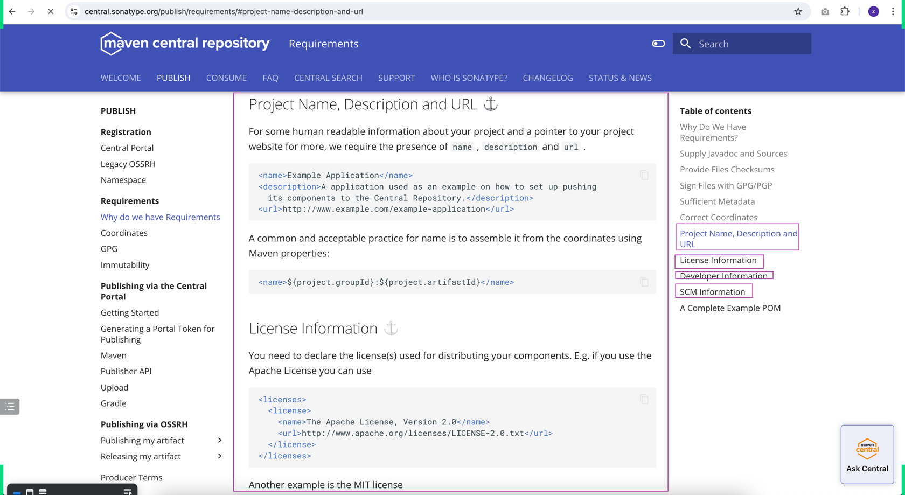
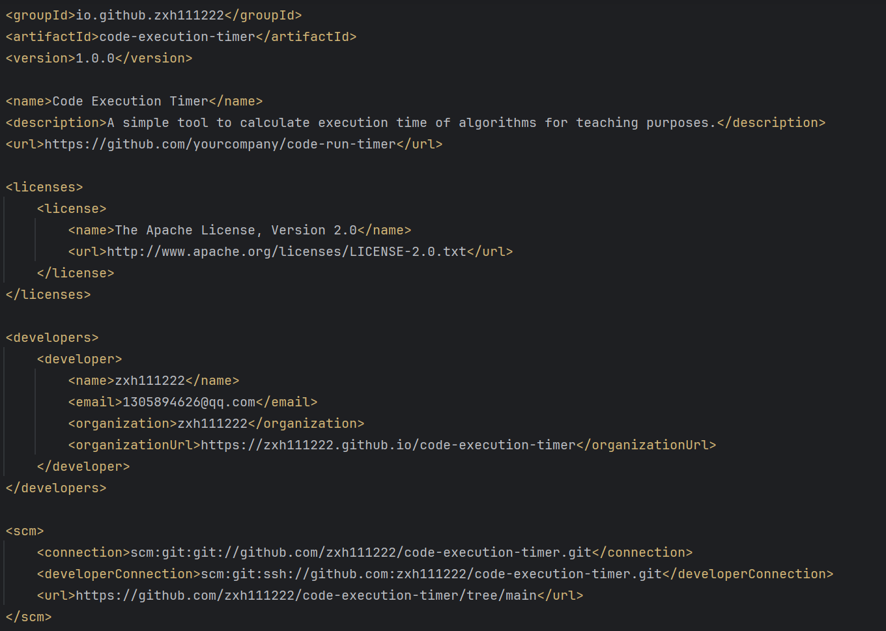
比如我这个项目的信息如下: 
```dtd
    <groupId>io.github.zxh111222</groupId>
    <artifactId>code-execution-timer</artifactId>
    <version>1.0.0</version>

    <name>Code Execution Timer</name>
    <description>A simple tool to calculate execution time of algorithms for teaching purposes.</description>
    <url>https://github.com/yourcompany/code-run-timer</url>

    <licenses>
        <license>
            <name>The Apache License, Version 2.0</name>
            <url>http://www.apache.org/licenses/LICENSE-2.0.txt</url>
        </license>
    </licenses>

    <developers>
        <developer>
            <name>zxh111222</name>
            <email>1305894626@qq.com</email>
            <organization>zxh111222</organization>
            <organizationUrl>https://zxh111222.github.io/code-execution-timer</organizationUrl>
        </developer>
    </developers>

    <scm>
        <connection>scm:git:git://github.com/zxh111222/code-execution-timer.git</connection>
        <developerConnection>scm:git:ssh://github.com:zxh111222/code-execution-timer.git</developerConnection>
        <url>https://github.com/zxh111222/code-execution-timer/tree/main</url>
    </scm>
```

### 第三步 - `mvn install` 生成那四个原始的文件
- 去电脑中(一般是C盘你的User文件夹下有的.m2文件夹下) .m2/repository/【你的 groupid 】/【artifactid】/【version】下验证有那4个上传到远程参考需要的原始资料
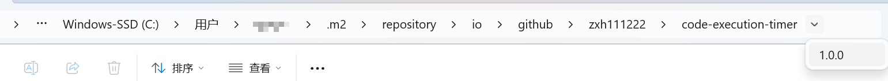
- jar、javadoc、sources、pom
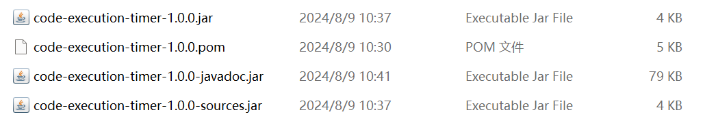

### 第四步 - Checksums
- 参考资料：https://maven.apache.org/plugins-archives/maven-install-plugin-2.4/examples/installing-checksums.html
- `mvn install -DcreateChecksum=true`
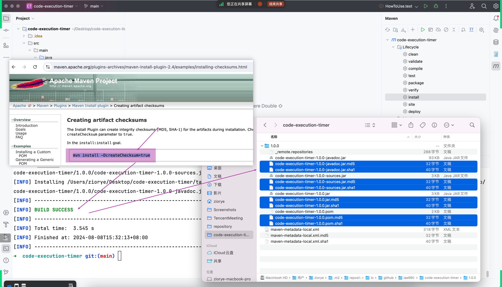
- 这一步生成那四个原始的文件和四个原始文件的 Checksums
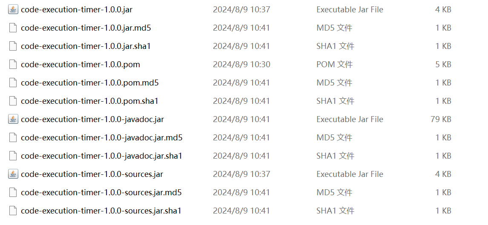

#### 特别注意 - 使用 `mvn install -DcreateChecksum=true` 可能会发现没有用生成 Checksums，原因和解决方案如下
- 原因: Maven 版本问题引起的 - 例如我一开始使用的 Maven 版本是 3.9.8 ，而 `Maven Install Plugin` 版本是 3.1.2，`Maven Install Plugin` 高于了 3.x.x 版本，这些版本的 `-DcreateChecksum=true` 命令被弃用
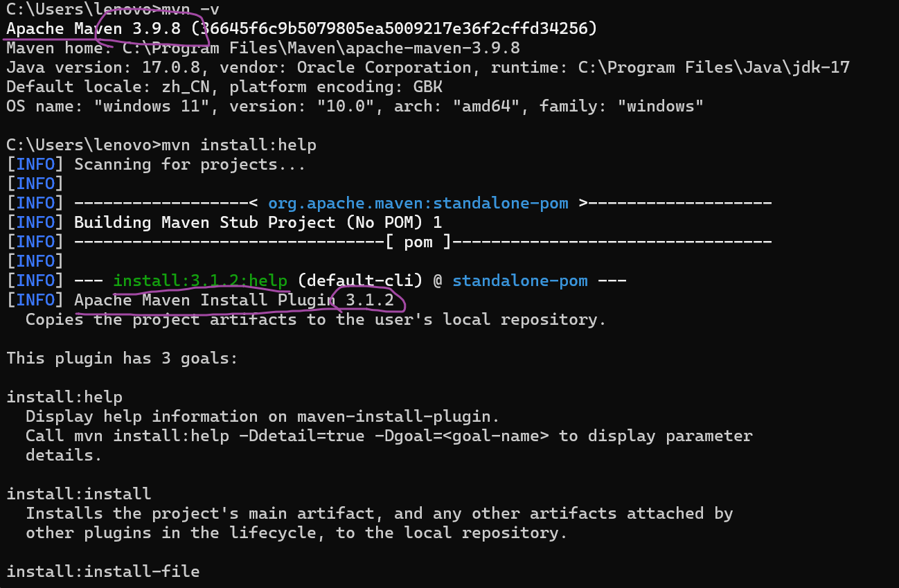
- 两种解决方案: 
1. 降低 Maven 版本使得 `Maven Install Plugin` 版本是低于 3.0.0 版本(不包括)  
例如，我重新下载了 Maven 3.8.8，此版本的 `Maven Install Plugin` 版本是 2.4，此时即可生成那四个原始的文件和四个原始文件的 Checksums
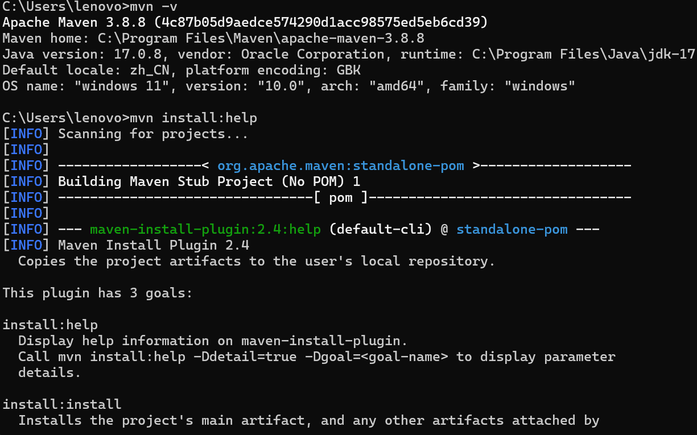

2. 根据官网的描述，已经知道现在把 `createChecksum` 功能移到了 `deploy` 插件，那我们就改调用 `mvn deploy ...` 命令来解决
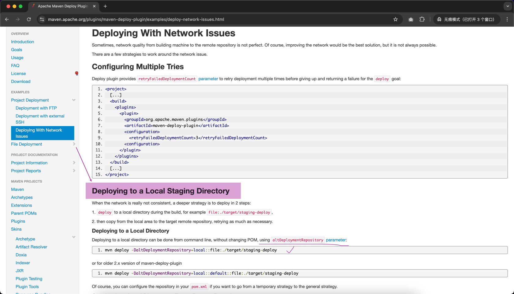
- https://maven.apache.org/plugins/maven-deploy-plugin/examples/deploy-network-issues.html
- mvn deploy -DaltDeploymentRepository=local::file:./target/staging-deploy
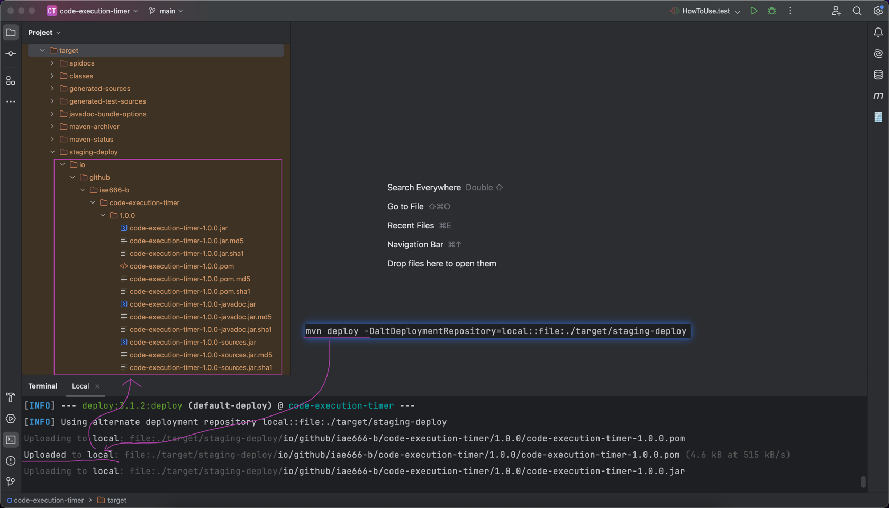
- 额外的好处：生成的文件已经按规定好的 layout 路径存放了

### 第五步 - Signature
- 参考资料：https://central.sonatype.org/publish/requirements/gpg/
- 官方文档的参考文档很详细，跟着步骤做即可
#### 核心步骤: Installing GnuPG、Generating a Key Pair、Listing Keys、Signing a File、Distributing Your Public Key
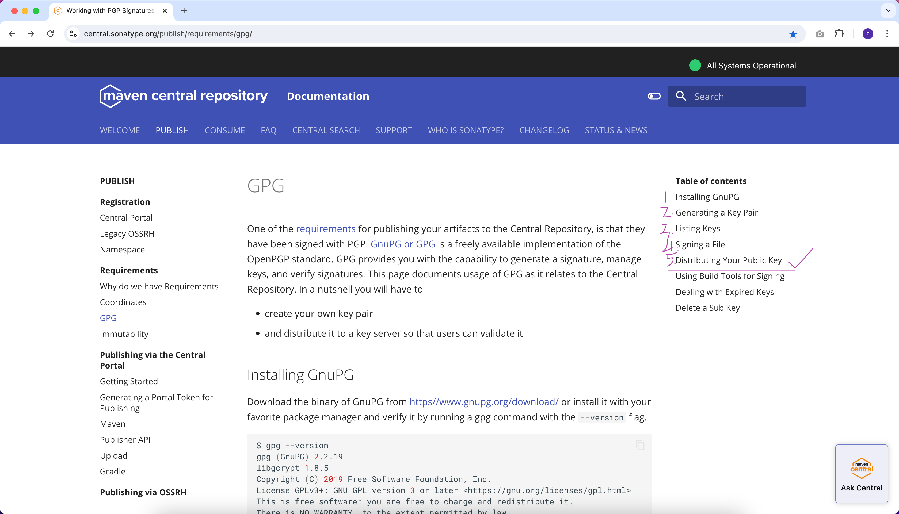
- Distributing Your Public Key的步骤如果遇到问题
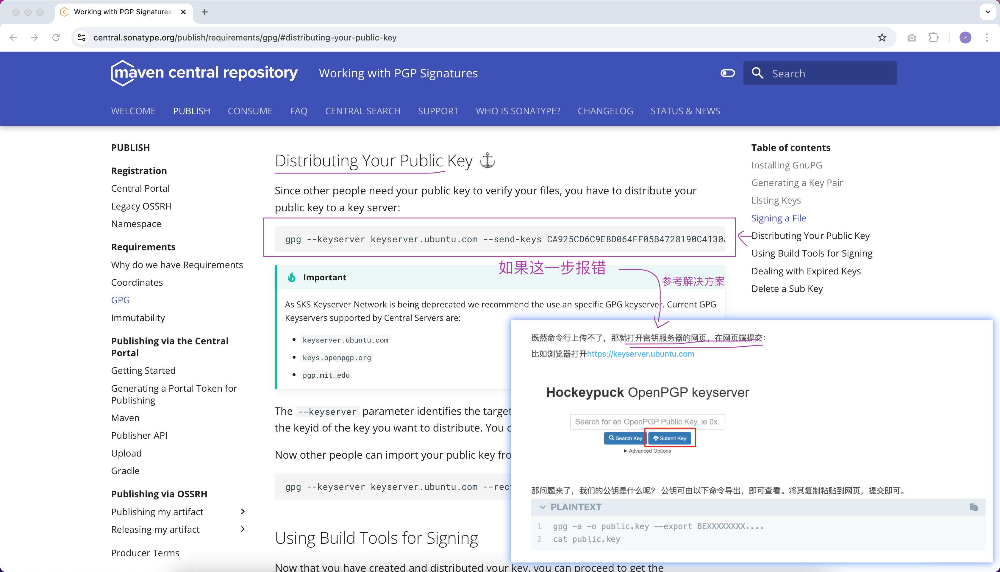
- 参考资源：https://vayne.cc/2022/03/13/gpg/

- 用 pgp 对那 4 个 jar 包进行 signature => ***jar.asc 
  - gpg -ab code-execution-timer-1.0.0.jar 
  - gpg -ab code-execution-timer-1.0.0-javadoc.jar 
  - gpg -ab code-execution-timer-1.0.0-sources.jar 
  - gpg -ab code-execution-timer-1.0.0.pom

- 校验所有需要的文件是否都准备好了
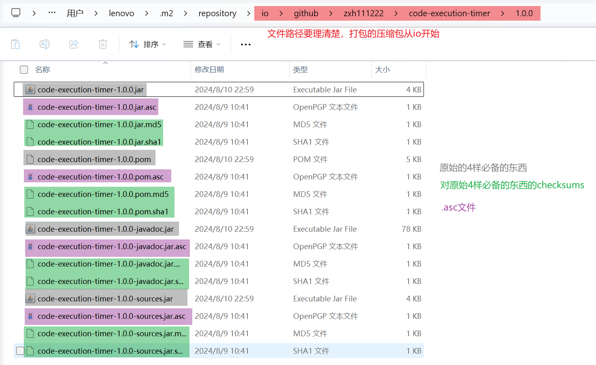

### 第六步 - 打成压缩包
- 先检查 `第一步` 和 `第二步` 的 `pom.xml`, `提供必要的信息` 完成了没有

### 第七步 - 上传和发布
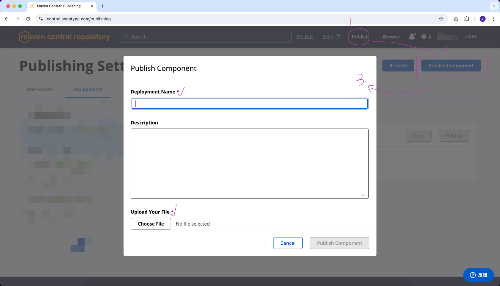
- 上传之后的配图
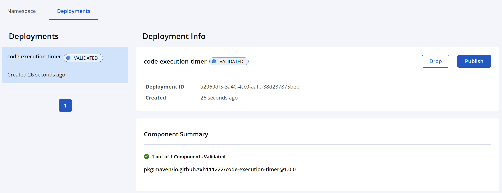
- Publish 真正发布
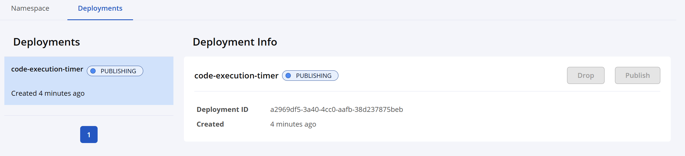
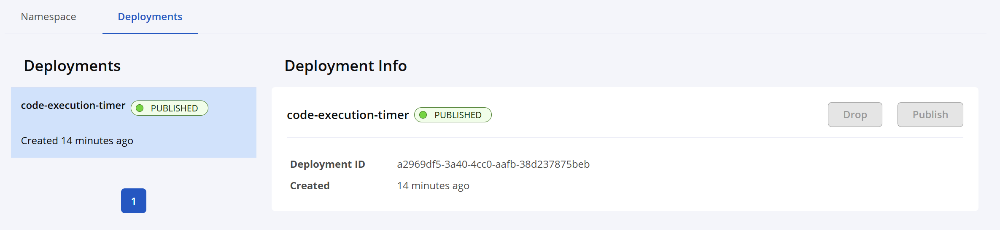
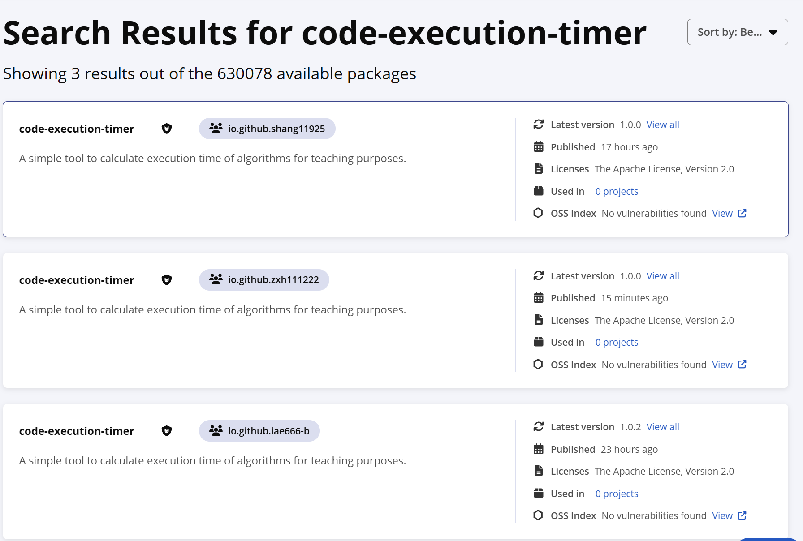

### 第八步 - 验证 
1. 把之前安装到本地的 artifact 删掉
2. 在 IDEA 的 maven 那边刷新一下，看是否能从远程下载回来
3. 注意: settings.xml 文件可能要把国内镜像配置注释掉
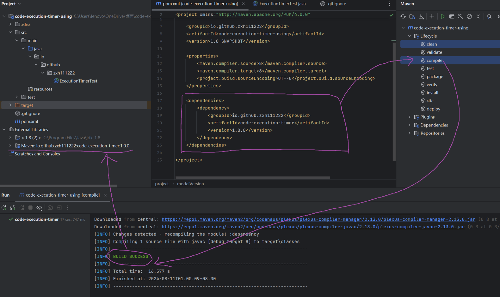

## 改进1: 用 maven 插件，自动生成 `PGP signature`
- 见 day20240808 Readme.md 的 `maven-gpg-plugin`

## 改进2: 用 maven 插件，自动上传和发布
- 见 day20240808 Readme.md 的 `central-publishing-maven-plugin`

## 改进3: pom.xml 中的 build 内容精简优化，暂时先不用 `pluginManagement`
```dtd
<build>
    <plugins>
        <plugin>
            <groupId>org.apache.maven.plugins</groupId>
            <artifactId>maven-javadoc-plugin</artifactId>
            <version>3.8.0</version>
            <executions>
                <execution>
                    <goals>
                        <goal>jar</goal>
                    </goals>
                </execution>
            </executions>
        </plugin>
        <plugin>
            <groupId>org.apache.maven.plugins</groupId>
            <artifactId>maven-source-plugin</artifactId>
            <version>3.3.1</version>
            <executions>
                <execution>
                    <goals>
                        <goal>jar-no-fork</goal>
                    </goals>
                </execution>
            </executions>
        </plugin>
        <plugin>
            <groupId>org.apache.maven.plugins</groupId>
            <artifactId>maven-gpg-plugin</artifactId>
            <version>3.2.4</version>
            <executions>
                <execution>
                    <id>sign-artifacts</id>
                    <phase>verify</phase>
                    <goals>
                        <goal>sign</goal>
                    </goals>
                </execution>
            </executions>
        </plugin>
        <plugin>
            <groupId>org.sonatype.central</groupId>
            <artifactId>central-publishing-maven-plugin</artifactId>
            <version>0.5.0</version>
            <extensions>true</extensions>
            <configuration>
                <publishingServerId>central</publishingServerId>
                <autoPublish>true</autoPublish>
                <waitUntil>validated</waitUntil><!-- uploaded、validated、published -->
            </configuration>
        </plugin>
    </plugins>
</build>
```