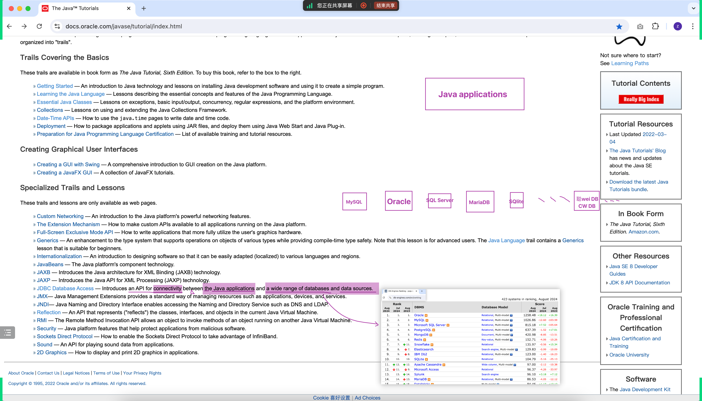
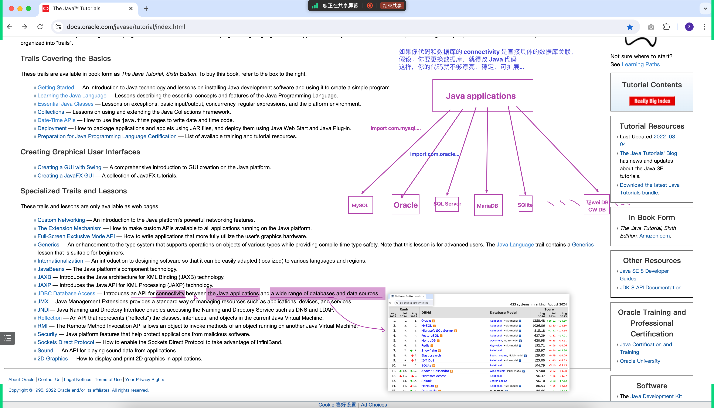
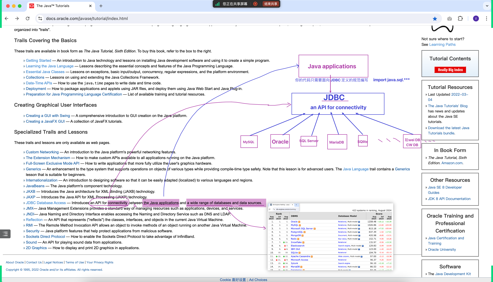
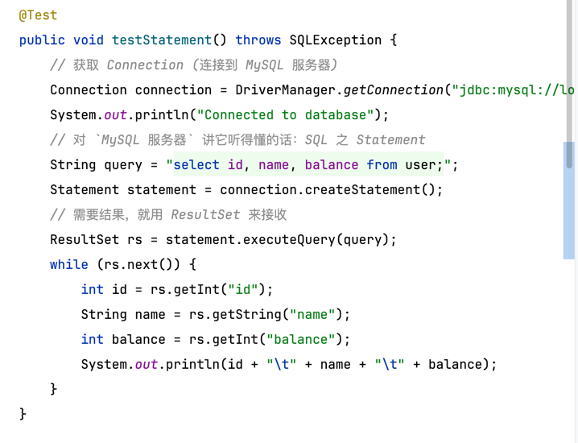
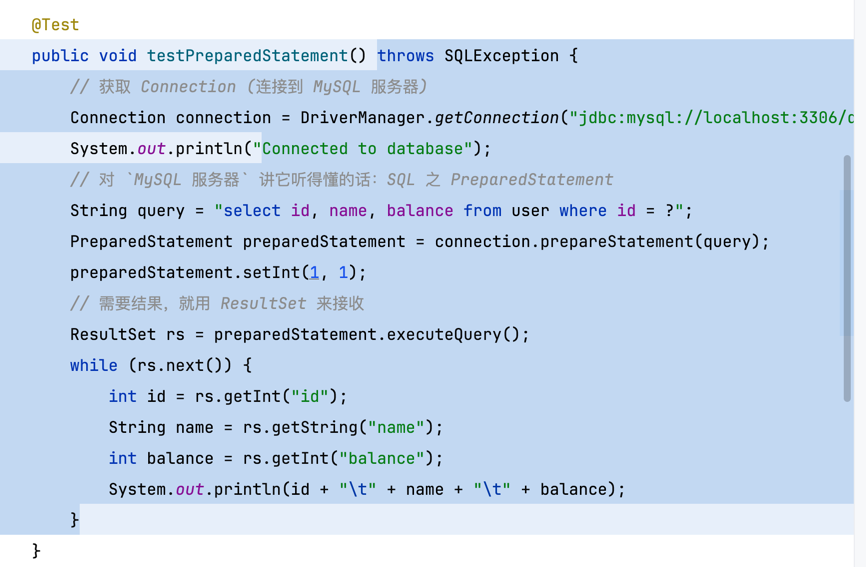
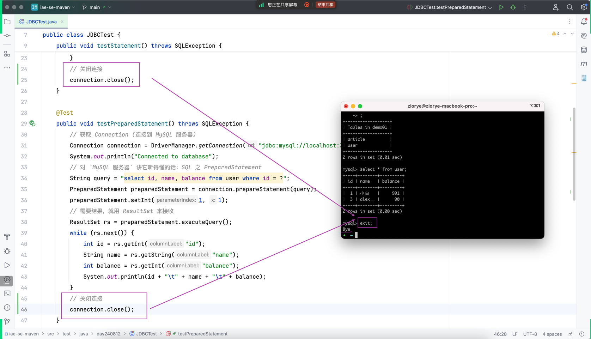
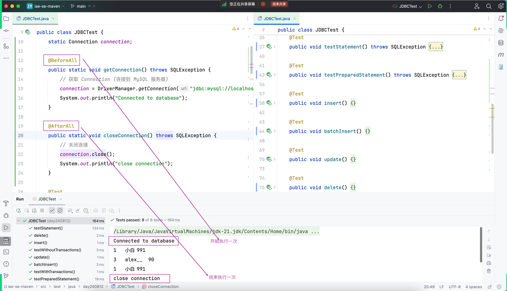

## 两个问题的思考

### 参考解释

- 同时回忆我们之前规划的阶段项目架构的目的：漂亮、稳定、可扩展

- 到了 JavaEE，到处都是 `接口` 和 `实现类` 之前的关系。而且 Java 只定义规范

### 验证过程

## 阅读一手资源之 JDBC

## 编写 JDBC 单元测试代码 

### 引出 JUnit5 的 @BeforeAll 和 @AfterAll

### 复习命令行敲过的 SQL
- mysql -uroot -p
- show databases;
- use demo01;
- show tables;
- select * from article;
- delete from article;
- exit;

